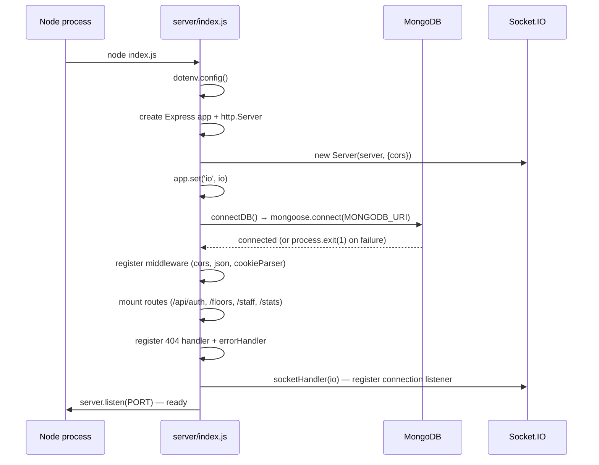
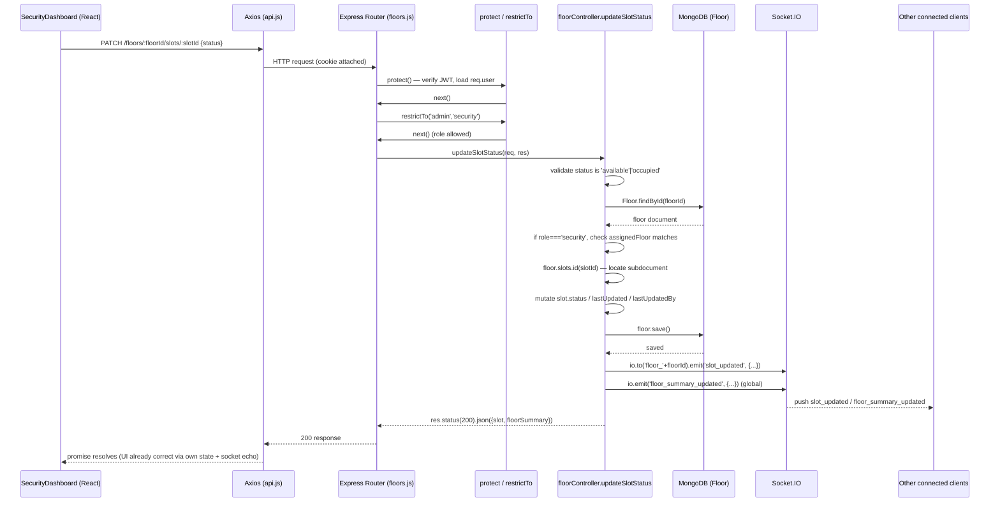
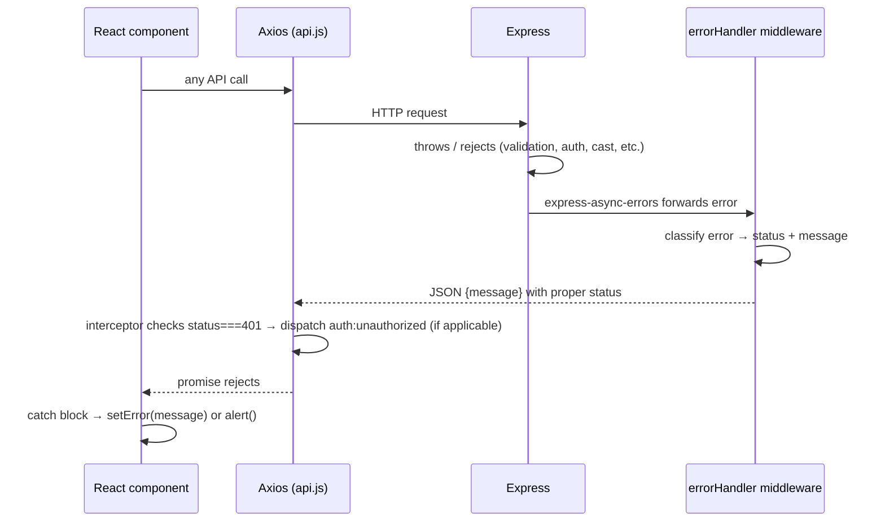

# Execution Flow — Smart Parking Availability System

> Traces exactly what happens, in order, from process boot to a user closing the tab. No code was modified to produce this document — it's a read-through of the existing implementation with sequence diagrams for the non-trivial flows.

---

## Table of Contents
1. [Application Startup](#1-application-startup)
2. [Frontend Rendering](#2-frontend-rendering)
3. [User Actions](#3-user-actions)
4. [API Requests](#4-api-requests)
5. [Backend Processing](#5-backend-processing)
6. [Validation](#6-validation)
7. [Database Queries](#7-database-queries)
8. [Response Sent Back](#8-response-sent-back)
9. [Error Handling](#9-error-handling)
10. [Important Functions Involved](#10-important-functions-involved)

---

## 1. Application Startup

Two independent Node processes are started manually in dev (per [README.md](README.md)): the backend first, then the frontend.

### 1a. Backend boot — `node index.js` / `npm run dev` (nodemon)

Everything happens synchronously, top-to-bottom, in [server/index.js](server/index.js):

1. `require('dotenv').config()` — loads `server/.env` into `process.env` (`PORT`, `MONGODB_URI`, `JWT_SECRET`, `JWT_EXPIRES_IN`, `CLIENT_URL`, `NODE_ENV`).
2. `require('express-async-errors')` — monkey-patches Express so any `async` route handler that throws/rejects is automatically forwarded to the error middleware (no manual try/catch needed in controllers).
3. An Express `app` is created, then wrapped in a raw `http.createServer(app)` — this is required so Socket.IO can attach to the *same* underlying HTTP server/port as the REST API.
4. A `socket.io` `Server` is created against that HTTP server, with CORS locked to `CLIENT_URL`.
5. `app.set('io', io)` — stashes the Socket.IO instance on the Express app so any controller can retrieve it later via `req.app.get('io')` (this is the bridge that lets REST writes trigger real-time broadcasts).
6. `connectDB()` ([server/config/db.js](server/config/db.js)) is called — opens the Mongoose connection to `MONGODB_URI`. On failure it logs and calls `process.exit(1)` (fail-fast: the server won't run without a DB).
7. Middleware is registered in order: `cors` → `express.json()` → `express.urlencoded()` → `cookieParser()`.
8. The four route groups are mounted: `/api/auth`, `/api/floors`, `/api/staff`, `/api/stats`.
9. `/api/health` and a catch-all 404 handler are registered.
10. The global `errorHandler` middleware is registered **last** (Express requires error middleware to be last in the chain).
11. `socketHandler(io)` ([server/socket/socketHandler.js](server/socket/socketHandler.js)) wires up the `connection`/`join_floor`/`leave_floor`/`disconnect` listeners.
12. `server.listen(PORT, ...)` — the process now accepts HTTP and WebSocket connections.



### 1b. Frontend boot — `npm run dev` (Vite)

1. Vite starts a dev server, serving [client/index.html](client/index.html).
2. `client/.env` is read at build/dev time — `VITE_API_URL`, `VITE_SOCKET_URL` become available via `import.meta.env`.
3. The HTML loads [client/src/main.jsx](client/src/main.jsx) as an ES module.
4. Nothing talks to the backend yet — that only happens once a browser actually opens the page (see Section 2).

At this point both processes are idle, waiting for a browser to connect.

---

## 2. Frontend Rendering

This is what happens the instant a user navigates to `http://localhost:5173` in a browser.

1. Browser downloads `index.html` → loads `main.jsx`.
2. [main.jsx](client/src/main.jsx): `createRoot(document.getElementById('root')).render(<App />)` inside `<StrictMode>`.
3. [App.jsx](client/src/App.jsx) renders `<BrowserRouter>` → `<AuthProvider>` → `<Routes>`. Nothing is fetched yet at this exact line — `AuthProvider` is what triggers the first network call.
4. `AuthProvider` ([AuthContext.jsx](client/src/context/AuthContext.jsx)) mounts with `user = null`, `loading = true`. Its `useEffect` fires `fetchCurrentUser()`:
   - Calls `GET /api/auth/me` via the shared Axios instance (cookies sent automatically if a prior session cookie exists).
   - If it succeeds (valid cookie) → `setUser(data.user)`.
   - If it fails (401, no cookie yet on a fresh visit) → `setUser(null)` (caught silently — this is the *expected* case for a brand-new anonymous driver).
   - Either way, `setLoading(false)` in `finally`.
5. While `loading` is `true`, any route wrapped in `ProtectedRoute` ([ProtectedRoute.jsx](client/src/components/common/ProtectedRoute.jsx)) shows a spinner instead of its real content — this prevents a flash of "redirect to /login" before the auth check resolves.
6. React Router matches the current path against the route table and renders the corresponding page. For an anonymous visitor at `/`, that's `<Navbar />` + `<HomePage />` — both public, no gating.
7. `HomePage` ([HomePage.jsx](client/src/pages/driver/HomePage.jsx)) renders and its `useFloors()` hook ([useFloors.js](client/src/hooks/useFloors.js)) fires on mount:
   - `GET /api/floors` → populates the floor summary cards.
   - Opens the shared Socket.IO client ([socket.js](client/src/services/socket.js)) if not already connected, and subscribes to `floor_summary_updated`.
8. Once data resolves, `FloorCard` components render for each floor with live available/occupied counts and an occupancy bar.

```mermaid
sequenceDiagram
    participant Browser
    participant Main as main.jsx
    participant App as App.jsx
    participant Auth as AuthContext
    participant Router as React Router
    participant Home as HomePage
    participant API as server (Axios/HTTP)
    participant Sock as Socket.IO server

    Browser->>Main: load index.html → main.jsx
    Main->>App: render <App />
    App->>Auth: mount AuthProvider (loading=true)
    Auth->>API: GET /api/auth/me
    API-->>Auth: 200 {user} OR 401
    Auth->>Auth: setUser(...); loading=false
    App->>Router: render <Routes> for current path "/"
    Router->>Home: render HomePage (public route)
    Home->>API: GET /api/floors (useFloors hook)
    API-->>Home: 200 {floors: [...]}
    Home->>Sock: socket.connect() + subscribe floor_summary_updated
    Home->>Browser: render FloorCard list
```

---

## 3. User Actions

Different user types trigger different downstream flows. All of them start the same way (Sections 1–2), then diverge:

| User | Action | What it triggers |
|---|---|---|
| **Driver** (anonymous) | Clicks a `FloorCard` | Navigates to `/floor/:id` → `FloorDetailPage` → `useFloor(id)` fetches `GET /api/floors/:id` and joins the `floor_<id>` socket room. |
| **Driver** | Leaves the floor detail page | `useFloor`'s cleanup emits `leave_floor` and unsubscribes `slot_updated`. |
| **Anyone** | Clicks "Staff Login" | Navigates to `/login` → `LoginPage`. |
| **Staff (any role)** | Submits login form | `AuthContext.login(username, password)` → `POST /api/auth/login`. On success, redirected to `/security` or `/admin` based on `user.role` (or back to the originally-requested protected page via `location.state.from`). |
| **Security staff** | Taps a slot on `SecurityDashboard` | `handleSlotClick` → `PATCH /api/floors/:floorId/slots/:slotId` — the single most important write path in the app (detailed in Section 5). |
| **Security/Admin** | Clicks "Logout" | `AuthContext.logout()` → `POST /api/auth/logout`, clears `user`, navigates to `/login`. |
| **Admin** | Views `/admin` (Overview) | `AdminOverview` fetches `GET /api/stats` on mount and again every 30s via `setInterval`. |
| **Admin** | Creates/edits/deactivates a floor | `AdminFloors` → `POST`/`PUT`/`DELETE /api/floors[...]`, then refetches the admin floor list. |
| **Admin** | Creates/edits/deactivates staff | `AdminStaff` → `POST`/`PUT`/`DELETE /api/staff[...]`, then refetches staff + floors. |

---

## 4. API Requests

All REST calls funnel through one shared Axios instance ([client/src/services/api.js](client/src/services/api.js)):

- **Base URL**: `VITE_API_URL` (default `http://localhost:5000/api`).
- **`withCredentials: true`**: ensures the `token` httpOnly cookie is sent with every request automatically — no manual header wiring needed in call sites.
- **Global response interceptor**: on *any* `401` response from *any* call, it dispatches a `window` `CustomEvent('auth:unauthorized')` before rejecting. `AuthContext` listens for this event and clears `user`, which cascades through `ProtectedRoute` to redirect to `/login` — this means individual pages/hooks never need their own 401-handling logic.

Real-time (non-REST) communication uses a second channel: the shared Socket.IO client ([client/src/services/socket.js](client/src/services/socket.js)), connected lazily (`autoConnect: false`) only once a component that needs live data mounts (`useFloor`/`useFloors`).

---

## 5. Backend Processing

Using the highest-value example — **security staff toggling a parking slot** — since it exercises the full stack including the socket broadcast:



**Step-by-step breakdown:**

1. **Routing** ([server/routes/floors.js](server/routes/floors.js)): `PATCH /:floorId/slots/:slotId` is registered with two middlewares before the controller: `protect`, then `restrictTo('admin', 'security')`.
2. **`protect`** ([server/middleware/auth.js](server/middleware/auth.js)): reads the `token` cookie (or `Authorization: Bearer` header fallback), `jwt.verify`s it, loads the `User` from Mongo (excluding password), rejects with `401` if the token is invalid/expired or the user is missing/deactivated. Attaches `req.user`.
3. **`restrictTo(...roles)`**: rejects with `403` if `req.user.role` isn't in the allowed list. Both `admin` and `security` may hit this endpoint — the *finer-grained* per-floor check happens inside the controller, not the middleware.
4. **Controller** ([server/controllers/floorController.js](server/controllers/floorController.js) `updateSlotStatus`) runs the actual business logic (detailed further in Sections 6–7).
5. **Socket broadcast**: `req.app.get('io')` retrieves the Socket.IO instance set at startup; two events are emitted — a room-scoped `slot_updated` (only clients currently viewing that floor) and a global `floor_summary_updated` (so the homepage's aggregate counts stay correct too).
6. **HTTP response**: the controller returns the updated slot and a floor summary directly to the caller, so the guard's own screen is correct even independent of the socket round-trip.

All other write endpoints (`createFloor`, `updateFloor`, `deleteFloor`, `createStaff`, `updateStaff`, `deleteStaff`) follow the same routing → middleware → controller → Mongo pattern, just without the socket-emit step (only slot toggles are broadcast in real time).

Read-only endpoints (`GET /api/floors`, `GET /api/floors/:id`, `GET /api/stats`) skip the mutation/broadcast steps entirely — it's routing → (middleware, where applicable) → controller query → Mongo `.find()`/`.findById()` → JSON response.

---

## 6. Validation

Validation happens at three layers, in this order of execution:

1. **Auth/role gate (middleware layer)** — happens *before* any controller code runs:
   - `protect`: is there a valid, non-expired JWT for an existing, active user?
   - `restrictTo(...roles)`: does that user's `role` permit this route at all?
2. **Controller-level business validation** (explicit `if` checks, before touching the DB):
   - `authController.login`: `username`/`password` both present (`400` if not).
   - `floorController.updateSlotStatus`: `status` must be exactly `'available'` or `'occupied'` (`400` otherwise); if the caller is `security`, their `assignedFloor` must match the `floorId` in the URL (`403` otherwise) — this is the one authorization check that can't be expressed as a static route-level role, since it depends on *which* floor is being touched.
   - `floorController.createFloor`: `name`, `level`, `rows`, `slotsPerRow` are all required (`400` otherwise).
   - `staffController.createStaff`: `name`, `username`, `password` required; explicit duplicate-username pre-check (`400` "Username already taken") even though the schema also enforces uniqueness — this gives a friendlier error message before hitting a raw Mongo duplicate-key error.
3. **Schema-level validation (Mongoose)** — runs automatically on `.save()`/`.create()`, as a final backstop even if a controller's manual checks were bypassed or incomplete:
   - `User`: `name`/`username`/`password` required, `password` `minlength: 6`, `username` unique, `role` restricted to the `enum` `['admin','security']`.
   - `Floor`: `name`/`level` required and unique, slot `status` restricted to the `enum` `['available','occupied']`.
   - If a Mongoose validation error or duplicate-key error is thrown here, it's caught by the global `errorHandler` (Section 9), not by the controller.

There is **no separate request-body validation library** (e.g. Joi/Zod/express-validator) in this codebase — validation is done with plain `if` statements in controllers plus Mongoose schema constraints as the backstop.

---

## 7. Database Queries

All queries go through Mongoose models — `Floor` and `User`. Representative queries per flow:

| Flow | Query |
|---|---|
| Homepage load | `Floor.find({ isActive: true }).select('name level totalSlots slots displayOrder').sort({ displayOrder: 1, level: -1 })` |
| Floor detail | `Floor.findById(id).populate('slots.lastUpdatedBy', 'name')` |
| Slot toggle | `Floor.findById(floorId)` → mutate embedded subdoc → `floor.save()` |
| Login | `User.findOne({ username, isActive: true }).select('+password').populate('assignedFloor', 'name level')` |
| Current user (`/auth/me`) | `User.findById(req.user._id).populate('assignedFloor', 'name level')` |
| Admin stats | `Floor.find({ isActive: true })` (aggregated in JS) + `User.countDocuments({ role: 'security', isActive: true })` |
| Create floor | `Floor.create({ name, level, slots, displayOrder })` — `slots` array is generated in the controller from `rows × slotsPerRow` before insert |
| Update/deactivate floor | `Floor.findByIdAndUpdate(id, {...}, { new: true, runValidators: true })` |
| Staff list | `User.find({ role: 'security' }).populate('assignedFloor', 'name level').select('-password')` |
| Create staff | duplicate-check `User.findOne({ username })`, then `User.create({...})` (password hashed by the model's `pre('save')` hook) |

Notable schema-driven behavior that affects query results:
- `Floor.availableCount` / `occupiedCount` are **virtuals** — computed at read time by filtering the in-memory `slots` array, never stored. This is why any consumer that only receives a partial patch (like a socket event carrying just one slot) must recompute counts client-side rather than trusting a stale virtual.
- `Floor.totalSlots` is kept in sync via a `pre('save')` hook (`this.totalSlots = this.slots.length`) — it cannot drift from the actual slot count as long as writes go through `.save()`.
- `User.password` has `select: false` — it is excluded from every query by default; the login flow is the one place that explicitly opts back in with `.select('+password')`.

---

## 8. Response Sent Back

Standard shape across the API: `res.status(code).json({ message?, ...data })`. Examples:

- **Success (read)**: `200 { floors: [...] }`, `200 { floor: {...} }`, `200 { stats: {...} }`.
- **Success (write)**: `200/201 { message: '...', <resource>: {...} }` — e.g. `updateSlotStatus` returns `{ message, slot, floorSummary: { availableCount, occupiedCount } }`.
- **Auth success**: `200 { message, user, token }` **and** a `Set-Cookie: token=...; HttpOnly` header — the body's `token` field exists specifically for non-cookie (e.g. mobile) clients, per the code comment in `authController.js`.
- **Client-side handling**: each hook/page stores the relevant piece of the response in local state (`setFloor`, `setFloors`, `setStats`, `setUser`) — there's no global Redux-style store; each component/hook owns just the data it needs.
- **Socket responses** aren't really "responses" — they're server-initiated pushes (`slot_updated`, `floor_summary_updated`) with no acknowledgment expected from the client.

---

## 9. Error Handling

Two layers, backend and frontend, working together:

### Backend
- `express-async-errors` means any `throw` or rejected promise inside an `async` controller is automatically routed to Express's error-handling middleware — no controller needs its own try/catch.
- [errorHandler.js](server/middleware/errorHandler.js) is the single place all errors are normalized:
  - Mongoose duplicate key (`err.code === 11000`) → `400` "A record with this `<field>` already exists."
  - Mongoose `ValidationError` → `400` with all validation messages joined.
  - Mongoose `CastError` (e.g. malformed ObjectId in a URL param) → `400` "Invalid `<path>`: `<value>`".
  - `JsonWebTokenError` → `401` "Invalid token."
  - `TokenExpiredError` → `401` "Token has expired. Please log in again."
  - Anything else → whatever `statusCode`/`message` the error carries, defaulting to `500`.
  - In `development`, the error is also logged server-side and the stack trace is included in the JSON response; both are suppressed in `production`.
- Explicit `4xx` responses (bad input, not found, forbidden) are returned directly by controllers via `res.status(...).json(...)` — these don't go through `errorHandler` at all since they aren't thrown errors, just normal early returns.
- Unmatched routes fall through to the 404 handler registered in `index.js` before `errorHandler`.

### Frontend
- Every data-fetching hook/page (`useFloor`, `useFloors`, `AdminOverview`, `AdminFloors`, `AdminStaff`, `LoginPage`) wraps its Axios call in `try/catch`, reading `err.response?.data?.message` for a user-facing string, shown either inline (`error-state` divs, form error banners) or via `alert()` for admin destructive actions.
- Pages showing an error state typically also render a "Retry" button that just re-invokes the same fetch function.
- **Global 401 handling** is centralized (see Section 4): the Axios interceptor in `api.js` catches every 401 app-wide and dispatches `auth:unauthorized`, which `AuthContext` turns into `setUser(null)`, which `ProtectedRoute` turns into a redirect — three decoupled layers cooperating without any hook needing to know about the others.
- `SecurityDashboard.handleSlotClick` has a specific recovery path: on a failed PATCH, it `alert()`s the message *and* calls `refetch()` to pull the true current state from the server — guarding against the local optimistic-ish UI (which relies on the socket echo) drifting from reality if the write actually failed.



---

## 10. Important Functions Involved

### Backend
| Function | File | Role |
|---|---|---|
| `connectDB` | [server/config/db.js](server/config/db.js) | Opens the Mongoose/MongoDB connection at startup. |
| `signToken`, `sendTokenResponse` | [server/controllers/authController.js](server/controllers/authController.js) | Create the JWT and attach it as an httpOnly cookie + body field. |
| `login`, `logout`, `getMe` | [server/controllers/authController.js](server/controllers/authController.js) | Auth endpoints. |
| `getAllFloors`, `getFloorById` | [server/controllers/floorController.js](server/controllers/floorController.js) | Public read endpoints for drivers. |
| `updateSlotStatus` | [server/controllers/floorController.js](server/controllers/floorController.js) | The core real-time write path — validates, authorizes per-floor, mutates, saves, broadcasts. |
| `createFloor`, `updateFloor`, `deleteFloor`, `getAllFloorsAdmin` | [server/controllers/floorController.js](server/controllers/floorController.js) | Admin floor management. |
| `getAllStaff`, `createStaff`, `updateStaff`, `deleteStaff` | [server/controllers/staffController.js](server/controllers/staffController.js) | Admin staff management. |
| `getStats` | [server/controllers/statsController.js](server/controllers/statsController.js) | Aggregates floor + staff stats for the admin overview. |
| `protect`, `restrictTo` | [server/middleware/auth.js](server/middleware/auth.js) | JWT verification and role gating for every protected route. |
| `errorHandler` | [server/middleware/errorHandler.js](server/middleware/errorHandler.js) | Central error normalization. |
| `socketHandler` | [server/socket/socketHandler.js](server/socket/socketHandler.js) | Registers `join_floor`/`leave_floor`/`disconnect` on every new socket connection. |
| `userSchema.pre('save')`, `comparePassword` | [server/models/User.js](server/models/User.js) | Password hashing and verification. |
| `floorSchema.virtual('availableCount'/'occupiedCount')`, `floorSchema.pre('save')` | [server/models/Floor.js](server/models/Floor.js) | Derived counts and `totalSlots` sync. |

### Frontend
| Function/Hook | File | Role |
|---|---|---|
| `AuthProvider`, `fetchCurrentUser`, `login`, `logout` | [client/src/context/AuthContext.jsx](client/src/context/AuthContext.jsx) | Global auth state and session bootstrap. |
| `ProtectedRoute` | [client/src/components/common/ProtectedRoute.jsx](client/src/components/common/ProtectedRoute.jsx) | Route-level auth/role gating. |
| `useFloors` | [client/src/hooks/useFloors.js](client/src/hooks/useFloors.js) | Homepage data + `floor_summary_updated` socket subscription. |
| `useFloor` | [client/src/hooks/useFloor.js](client/src/hooks/useFloor.js) | Single-floor data + `slot_updated` socket subscription, join/leave room lifecycle. |
| `api` (Axios instance) + response interceptor | [client/src/services/api.js](client/src/services/api.js) | All REST calls; global 401 → `auth:unauthorized` event. |
| `socket` (shared client) | [client/src/services/socket.js](client/src/services/socket.js) | Single lazy-connecting Socket.IO client instance reused app-wide. |
| `handleSlotClick` | [client/src/pages/security/SecurityDashboard.jsx](client/src/pages/security/SecurityDashboard.jsx) | Triggers the slot-toggle PATCH request; recovers via `refetch()` on failure. |
| `fetchFloors`/`handleSave`/`handleDelete` | [client/src/pages/admin/AdminFloors.jsx](client/src/pages/admin/AdminFloors.jsx) | Admin floor CRUD orchestration. |
| `fetchData`/`handleSave`/`handleDeactivate` | [client/src/pages/admin/AdminStaff.jsx](client/src/pages/admin/AdminStaff.jsx) | Admin staff CRUD orchestration. |

---

## Summary

Every meaningful interaction in this app resolves into one of three shapes:

1. **Pure read** — component mounts → hook fires Axios GET → Express route (with auth middleware where required) → controller → Mongoose query → JSON response → local React state → render.
2. **Write with broadcast** (slot toggle only) — same as above, but the controller also emits Socket.IO events after a successful save, so every other connected client's hook patches its state without polling.
3. **Write without broadcast** (all admin CRUD, auth) — same request/response cycle as a pure read, but ends in a Mongo mutation; the initiating client refetches its own list to see the change, other clients are unaffected until they refresh.

Auth and error handling are both deliberately centralized (JWT middleware on the backend; Axios interceptor + `AuthContext` event on the frontend) so that individual routes/components stay simple and don't duplicate cross-cutting logic.
